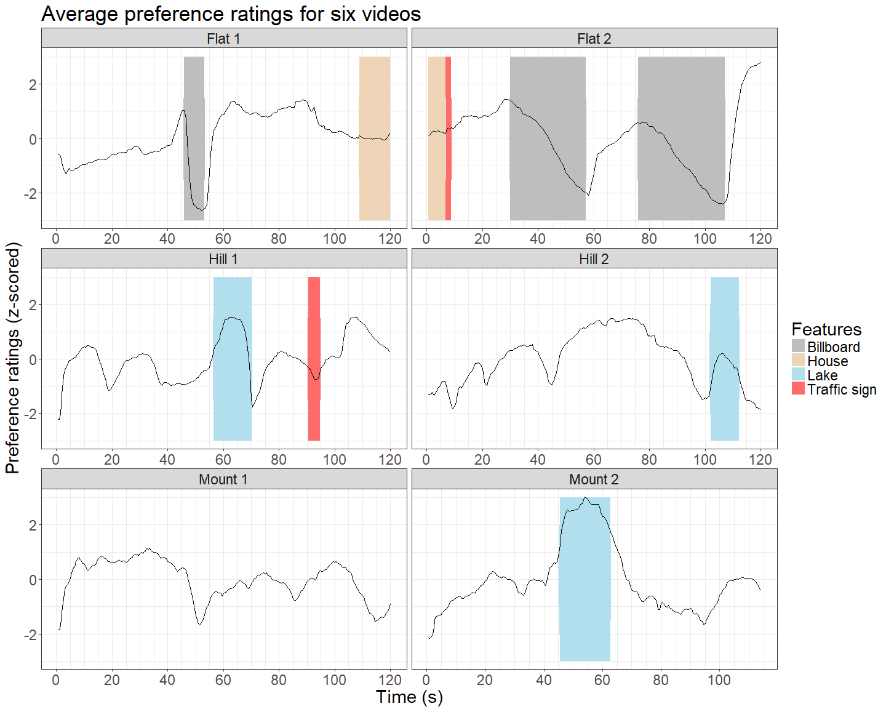

critique
================

Part I: visualization critique
------------------------------

#### Source website: <http://flowingdata.com/2016/05/17/the-changing-american-diet/>

#### Truthful:

The presentation is truthful in a way that the author told the audience where the data for visualization came from, which is the food database provided by the United States Department of Agriculture. This source is quite reliable, and the data should mostly be accurate. There is the average amount of consumption (with precision to two decimal places) for each year per person for each item in different units.

However, the author did not include the details of how he analyzed the data and made the plots. It could be unclear that how the consumption of different food was measured, how they collected the data, and what was the composition of the population. Both measurement and population could influence how the data should be interpreted.

#### Functional:

In general, the visualization is quite functional. It shows the changing trend of the consumption of different food from 1971 to 2013. Readers can interact with the plots by checking out what is the average daily consumption of a certain type of food in a specific year. Within each category, readers could make comparisons between different items. For example, in the vegetables, potatoes have a relatively consistent consumption rate, whereas the dark green has an increasing consumption trend, indicating that American people retained high preference for potatoes throughout these decades and preferred more dark green in recent decades. The amount of consumption for different food within one category can also be compared by scaling by group. For example, in the fruit category, apples and bananas were the top two consumption fruit. People consumed apples and bananas much more than other fruit. Moreover, the graph can be interactive in slow, medium and fast speed, showing the changes in ranking for different food within the category across time. This interaction gives people a sense of what is being more popular or what is being less popular in the diet.

This visualization is very informative to lay audience to have a basic idea of the changes in diet of specific food items. However, there are few things that make the graph not very functional for a more precise understanding of the diet change. By looking at each graph of food moving up and down, it is hard to keep track of the changing trend of the ranking for every food items. The rankings and amounts of consumption for different food items changed throughout the time. However, one question is that are those changes significant. It is unknown to the readers that whether the consumption for a certain food item increase or decrease significantly throughout the years or the changes are not significant.

The “scale by” function could be confusing in some ways. The author did not explain what the meaning was by scaling by group or item and which one was more accurate when making comparisons between items or categories. To my understanding, by scaling by group, the measures for all the items were standardized and we could make comparisons of different items within the group. And when scaling by items, the amount of changing in consumptions for every item was standardized, which suggested that the changing trends for different items were comparable. However, there is no way to confirm my guesses.

As different category is in different units, it is also complicated to make direct comparisons across categories. The readers might not know what one ounce to one cup is and what one cup to one gram is. If everything were set on the same standard, it would be easier to compare how much beef was consumed to potatoes.

Furthermore, when I wanted to check out for the food in the bottom rows, the year in the top right corner could not be shown in the same screen. Compared to items in the top rows, it is harder to check the data for items in the bottom rows.

#### Beautiful:

The visualization should not be labeled as beautiful, but instead as aesthetically acceptable or comfortable. The colors for differentiating different categories are distinctive and functional. They are in general consistent with the impressions of those food categories. For example, vegetables are colored in green, meet in rose, and fat in yellow. The combination of these six colors is also harmonic.

#### Insightful:

This visualization is kind of knowledge-building. It shows the audience of the changes of the composition of American people’s daily diet. The graph is not very surprising, but the audience would know more about this topic by interacting more with the graphs.

#### Enlightening:

The choice of the topic is important. From the changes in diet, we could tell the availability and the popularity of a certain food item, which might indicate the development of agriculture and the attitude of healthy lifestyle. This graph might also be beneficial to people who are in food industry to make things that cater to more people’s appetites and food choices. In those aspects, this visualization is enlightening.

However, to have a better understanding of the changes in the diet structure throughout the years, it would be better to have a big picture of the overall changes of each category in terms of proportions. For example, this visualization cannot tell the audience directly if people consume more vegetables or less compared to other food categories. The audience could only check out for the changes of a specific food item or comparing between different items, but they could not have a whole picture whether the diet is becoming healthier or not and in what ways.

Part II: ggplot2 and the grammar of graphics
--------------------------------------------

#### Some background about this graph

I used the dataset for my thesis in this homework. In this study, we investigated people’s aesthetic preference using a constructed highway environment with constantly changing surroundings. In order to examine how landscape characteristics influence people’s preferences, we developed six custom GIS-based 4D real-time highway driving simulations where we controlled the type and location of environmental features (i.e., trees, lake, billboard, house and traffic sign), and topography (flat, rolling hills and mountainous forest). Participants (N = 37) watched all six videos in pseudo-random order, while continuously indicating preference using a slide bar, with half second precision. By adjusting the slider up or down, participants indicated their likeness towards the landscape more or less correspondingly. The ratings were collected on a scale from 0-10 with a sensitivity of two decimal places.

#### Data transformation

In this visualization, I wanted to visualize whether different environmental features would affect people’s preference ratings. The four features (billboard, lake, house, and traffic sign) were all coded as binary variables. In order to compare the average ratings across videos, I z-scored the ratings across time per participant before taking the average. After combining data for six videos in one dataset, I also scaled the average ratings across six videos.

#### Visualizaiton process

Not all features were presented in each video. It would be messy if I plotted the ratings of six videos within the same graph. The first thing came to my mind was to use facet. In this way, the audience could have a clear view of what happened in each video. I first tried facet\_grid(. ~type), which allowed me to plot all the panels in one row. However, as there were six videos, there was not enough space in the horizontal direction. I then turned to use facet\_wrap with the videos of the same landscape type in the same row. The audience could make comparisons of videos with the same landscape type by looking horizontally and make comparisons of videos across different landscape types by looking vertically. I also adjusted the theme type, font size, and plot size in order to make it clear to see the titles and labels for each video. For finer adjustment, I changed the breaks for grids of x-axis into 5 seconds for more detailed presentation of the ratings in terms of time.

In order to corporate ratings and the presence of those features in the same graph, I chose to shade the area where the features were present. Instead of using a horizontal line or vertical line to indicate the region where a specific feature was present, using a rectangular box would mark clearly where the boundary was and shade the area where preference ratings might change. The data for these features were coded as 0 or 1. It could be misleading if only the area between 0 and 1 was shaded. Therefore, I made a small adjustment here to shade up to the most positive value and down to the most negative value. I first tried to use “Inf” to indicate the y value for the shaded area, but it would make some shaded areas unexpectedly join with each other. As the scaled preference ratings never exceed ±3, I enlarged the shaded area vertically to ±3 manually. To differentiate different features, I used four colors to indicate them, though they might not be the perfect color combination. It was hard to pick four distinctive colors for these features and not conflict with people’s common impressions of those elements.

#### Some conclusions

If we focus on the shaded areas, we could discover that billboard might be responsible for ratings dropping in both videos of flat terrains. House and traffic sign might not have a significant impact on preference ratings. In the lake-shaded area, there are spikes for preference ratings, which might indicate that people prefer lake as roadside environment. It is hard to have a conclusion of which landscape type that people prefer the most because every facet contains ups and downs of the ratings. And there are still changes in the ratings which are not explained by these four features. Therefore, this visualization can only tell us part of the story of people’s aesthetic preference.

#### Data visualization and R code

##### Importing data

``` r
library(tidyverse)
```

    ## -- Attaching packages ----------------------------------------------------------------------- tidyverse 1.2.1 --

    ## v ggplot2 2.2.1     v purrr   0.2.4
    ## v tibble  1.4.1     v dplyr   0.7.4
    ## v tidyr   0.7.2     v stringr 1.2.0
    ## v readr   1.1.1     v forcats 0.2.0

    ## -- Conflicts -------------------------------------------------------------------------- tidyverse_conflicts() --
    ## x dplyr::filter() masks stats::filter()
    ## x dplyr::lag()    masks stats::lag()

``` r
#select data for video type, time and ratings
sem_llvf <- read.csv("/Users/lyumu/Dropbox/2018muxuan/analysis/analysis_script/scale2gather_final.csv")
data_ratings <- sem_llvf[,c("time","type", "scene_type","AvePref")]

#select data for features information
sem_llvf2 <- read.csv("/Users/lyumu/Dropbox/2018muxuan/analysis/analysis_script/allcombined_final.csv")
data_features <- sem_llvf2[,c("billboard","lake","house","sign")]

#combine ratings and features data 
ratings_features <- cbind(data_ratings, data_features)

levels(ratings_features$type) <- c("Flat 1", "Flat 2", "Hill 1", "Hill 2", "Mount 1", "Mount 2")
```

##### Visualization

``` r
cols <- c("Billboard"="grey","Lake"="lightblue2", "House" = "bisque2", "Traffic sign" = "indianred1")

ratings_features %>%
  ggplot(aes(time, AvePref)) +
  geom_area(aes(time, -lake*3, fill = "Lake")) +
  geom_area(aes(time, lake*3, fill = "Lake")) +
  geom_area(aes(time, -billboard*3, fill = "Billboard")) +
  geom_area(aes(time, billboard*3, fill = "Billboard")) +
  geom_area(aes(time, -sign*3, fill = "Traffic sign")) +
  geom_area(aes(time, sign*3, fill = "Traffic sign")) +
  geom_area(aes(time, -house*3, fill = "House")) +
  geom_area(aes(time, house*3, fill = "House")) +
  geom_line() +
  facet_wrap( ~ type, scale = "free_x", nrow = 3) +
  scale_fill_manual(name="Features", values = cols) +
  #change font size
  theme_bw() +
  theme(text = element_text(size=22)) +
  #change grid breaks
  scale_x_continuous(breaks = seq(0, 120, by = 20), minor_breaks = seq(0, 120, 5)) +
  labs(title = "Average preference ratings for six videos",
       x = "Time (s)",
       y = "Preference ratings (z-scored)")
```



#### Session info

``` r
devtools::session_info()
```

    ## Session info -------------------------------------------------------------

    ##  setting  value                       
    ##  version  R version 3.4.3 (2017-11-30)
    ##  system   x86_64, mingw32             
    ##  ui       RTerm                       
    ##  language (EN)                        
    ##  collate  English_United States.1252  
    ##  tz       America/Chicago             
    ##  date     2018-04-09

    ## Packages -----------------------------------------------------------------

    ##  package    * version date       source        
    ##  assertthat   0.2.0   2017-04-11 CRAN (R 3.4.3)
    ##  backports    1.1.2   2017-12-13 CRAN (R 3.4.3)
    ##  base       * 3.4.3   2017-12-06 local         
    ##  bindr        0.1     2016-11-13 CRAN (R 3.4.3)
    ##  bindrcpp     0.2     2017-06-17 CRAN (R 3.4.3)
    ##  broom        0.4.3   2017-11-20 CRAN (R 3.4.3)
    ##  cellranger   1.1.0   2016-07-27 CRAN (R 3.4.3)
    ##  cli          1.0.0   2017-11-05 CRAN (R 3.4.3)
    ##  colorspace   1.3-2   2016-12-14 CRAN (R 3.4.3)
    ##  compiler     3.4.3   2017-12-06 local         
    ##  crayon       1.3.4   2017-09-16 CRAN (R 3.4.3)
    ##  datasets   * 3.4.3   2017-12-06 local         
    ##  devtools     1.13.5  2018-02-18 CRAN (R 3.4.3)
    ##  digest       0.6.13  2017-12-14 CRAN (R 3.4.3)
    ##  dplyr      * 0.7.4   2017-09-28 CRAN (R 3.4.3)
    ##  evaluate     0.10.1  2017-06-24 CRAN (R 3.4.3)
    ##  forcats    * 0.2.0   2017-01-23 CRAN (R 3.4.3)
    ##  foreign      0.8-69  2017-06-21 CRAN (R 3.4.1)
    ##  ggplot2    * 2.2.1   2016-12-30 CRAN (R 3.4.3)
    ##  glue         1.2.0   2017-10-29 CRAN (R 3.4.3)
    ##  graphics   * 3.4.3   2017-12-06 local         
    ##  grDevices  * 3.4.3   2017-12-06 local         
    ##  grid         3.4.3   2017-12-06 local         
    ##  gtable       0.2.0   2016-02-26 CRAN (R 3.4.3)
    ##  haven        1.1.0   2017-07-09 CRAN (R 3.4.3)
    ##  hms          0.4.0   2017-11-23 CRAN (R 3.4.3)
    ##  htmltools    0.3.6   2017-04-28 CRAN (R 3.4.3)
    ##  httr         1.3.1   2017-08-20 CRAN (R 3.4.3)
    ##  jsonlite     1.5     2017-06-01 CRAN (R 3.4.3)
    ##  knitr        1.18    2017-12-27 CRAN (R 3.4.3)
    ##  labeling     0.3     2014-08-23 CRAN (R 3.4.1)
    ##  lattice      0.20-35 2017-03-25 CRAN (R 3.4.3)
    ##  lazyeval     0.2.1   2017-10-29 CRAN (R 3.4.3)
    ##  lubridate    1.7.1   2017-11-03 CRAN (R 3.4.3)
    ##  magrittr     1.5     2014-11-22 CRAN (R 3.4.3)
    ##  memoise      1.1.0   2017-04-21 CRAN (R 3.4.4)
    ##  methods    * 3.4.3   2017-12-06 local         
    ##  mnormt       1.5-5   2016-10-15 CRAN (R 3.4.1)
    ##  modelr       0.1.1   2017-07-24 CRAN (R 3.4.3)
    ##  munsell      0.4.3   2016-02-13 CRAN (R 3.4.3)
    ##  nlme         3.1-131 2017-02-06 CRAN (R 3.4.3)
    ##  parallel     3.4.3   2017-12-06 local         
    ##  pillar       1.0.1   2017-11-27 CRAN (R 3.4.3)
    ##  pkgconfig    2.0.1   2017-03-21 CRAN (R 3.4.3)
    ##  plyr         1.8.4   2016-06-08 CRAN (R 3.4.3)
    ##  psych        1.7.8   2017-09-09 CRAN (R 3.4.3)
    ##  purrr      * 0.2.4   2017-10-18 CRAN (R 3.4.3)
    ##  R6           2.2.2   2017-06-17 CRAN (R 3.4.3)
    ##  Rcpp         0.12.14 2017-11-23 CRAN (R 3.4.3)
    ##  readr      * 1.1.1   2017-05-16 CRAN (R 3.4.3)
    ##  readxl       1.0.0   2017-04-18 CRAN (R 3.4.3)
    ##  reshape2     1.4.3   2017-12-11 CRAN (R 3.4.3)
    ##  rlang        0.1.6   2017-12-21 CRAN (R 3.4.3)
    ##  rmarkdown    1.8     2017-11-17 CRAN (R 3.4.3)
    ##  rprojroot    1.3-2   2018-01-03 CRAN (R 3.4.3)
    ##  rstudioapi   0.7     2017-09-07 CRAN (R 3.4.3)
    ##  rvest        0.3.2   2016-06-17 CRAN (R 3.4.3)
    ##  scales       0.5.0   2017-08-24 CRAN (R 3.4.3)
    ##  stats      * 3.4.3   2017-12-06 local         
    ##  stringi      1.1.6   2017-11-17 CRAN (R 3.4.2)
    ##  stringr    * 1.2.0   2017-02-18 CRAN (R 3.4.3)
    ##  tibble     * 1.4.1   2017-12-25 CRAN (R 3.4.3)
    ##  tidyr      * 0.7.2   2017-10-16 CRAN (R 3.4.3)
    ##  tidyverse  * 1.2.1   2017-11-14 CRAN (R 3.4.3)
    ##  tools        3.4.3   2017-12-06 local         
    ##  utils      * 3.4.3   2017-12-06 local         
    ##  withr        2.1.2   2018-03-15 CRAN (R 3.4.4)
    ##  xml2         1.1.1   2017-01-24 CRAN (R 3.4.3)
    ##  yaml         2.1.16  2017-12-12 CRAN (R 3.4.3)
